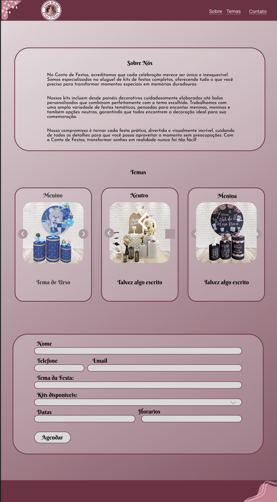
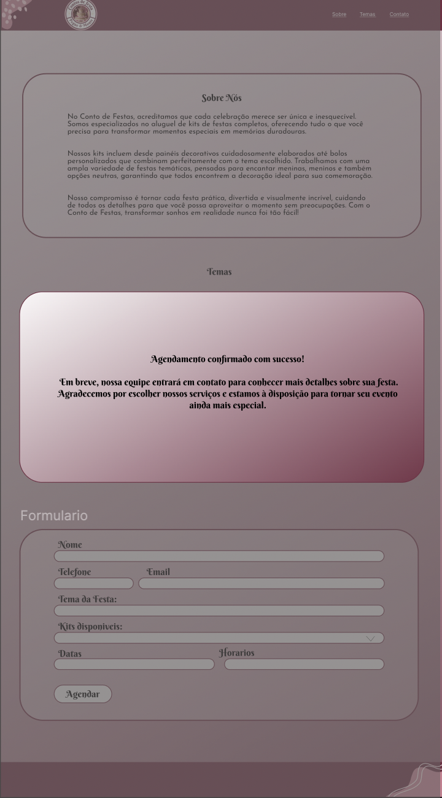

# Conto de Festas

## Integrantes

- Matteo Domiciano Varnier - 10390247
- Fernando Pegoraro Bilia - 10402097
- Rodrigo Barbosa - 10748173

## Motivação do Projeto

No **Conto de Festas**, acreditamos que cada celebração merece ser única e inesquecível. A ideia de criar este espaço surgiu para facilitar a forma de apresentar nossos trabalhos e tornar a escolha dos clientes ainda mais prática. Assim, reunimos em um só lugar todos os nossos kits de festas completos, prontos para transformar momentos especiais em memórias duradouras.

Nosso compromisso é tornar cada festa prática, divertida e visualmente incrível, cuidando de todos os detalhes para que você possa aproveitar o momento sem preocupações. Com o **Conto de Festas**, transformar sonhos em realidade nunca foi tão fácil!

## Caráter Extensionista

O **Conto de Festas** nasce como uma iniciativa de extensão que conecta o conhecimento acadêmico (tecnologia, design e gestão) às necessidades reais do mercado local de festas. O projeto promove a **aplicação prática do saber** por meio do desenvolvimento de uma plataforma que organiza o portfólio, padroniza a apresentação de kits e facilita o atendimento, ampliando a visibilidade digital e a profissionalização do negócio.

Com isso, o site gera **impacto social** ao fortalecer um empreendimento local, melhorar processos (catálogo, orçamento e comunicação) e tornar o serviço mais acessível aos clientes. Ao mesmo tempo, oferece aos estudantes um **ambiente de aprendizagem situada**, envolvendo análise de requisitos, usabilidade, métricas de atendimento e melhoria contínua, em diálogo direto com a comunidade.

## Prototipação

A página principal reúne todas as funcionalidades essenciais do site, com uma navegação simples e intuitiva através do menu no cabeçalho:

- **Sobre Nós** – espaço dedicado a apresentar a empresa, sua história e o propósito do Conto de Festas.
- **Temas** – galeria que exibe os kits de festas já realizados, permitindo ao cliente conhecer as opções disponíveis e se inspirar para sua comemoração.
- **Contato** – seção com um formulário prático, onde o cliente pode preencher seus dados, escolher o tema e o kit desejado, e solicitar o agendamento de forma rápida e direta.

Após a realização do agendamento pelo cliente, a segunda tela exibirá uma mensagem de confirmação, garantindo que a solicitação foi registrada com sucesso. Nela, o cliente será informado de que a equipe do Conto de Festas entrará em contato em breve para validar os dados fornecidos e alinhar os detalhes da celebração.

## Responsividade

Nosso projeto foi planejado inicialmente apenas para dispositivos móveis.
Como a maioria dos acessos virá pelo Instagram — plataforma onde são
apresentadas todas as decorações — decidimos priorizar a versão mobile. Dessa
forma, garantimos uma boa experiência em smartphones como iPhone, Samsung
e outros aparelhos com telas em torno de 400px de largura.
